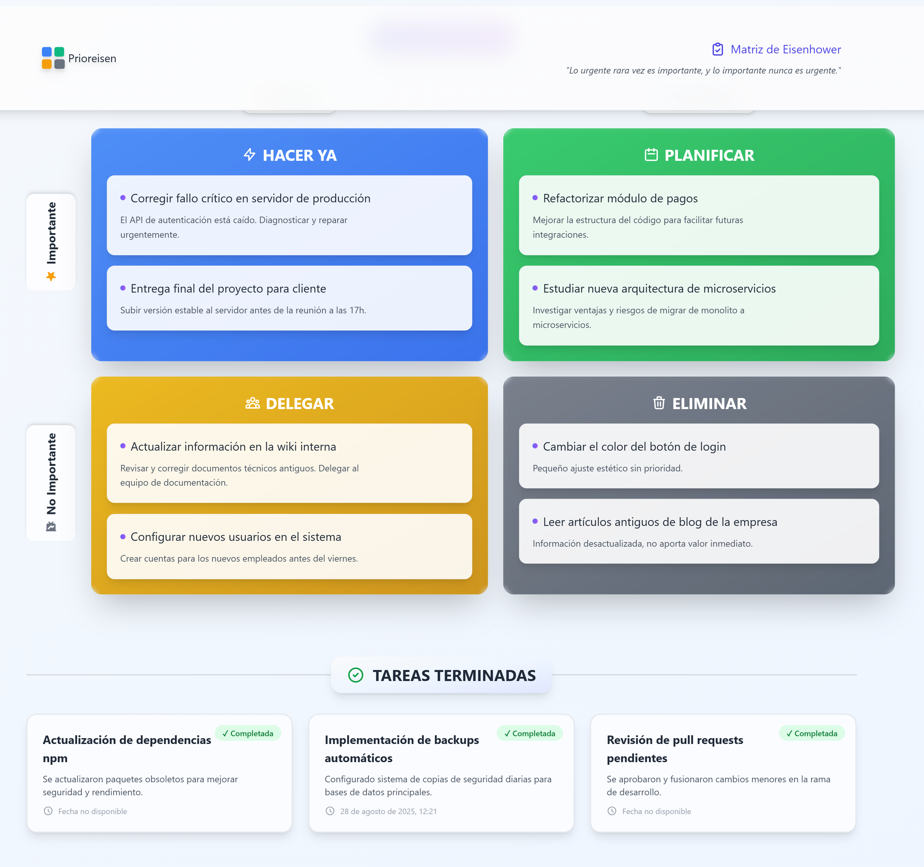
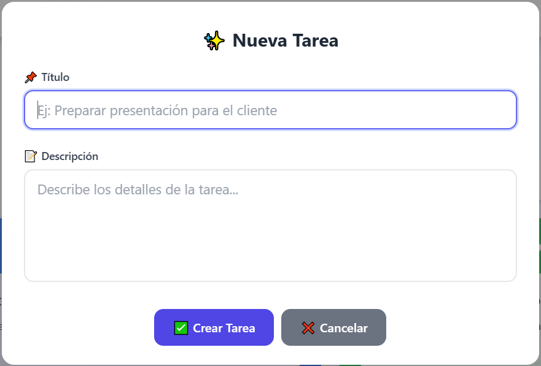
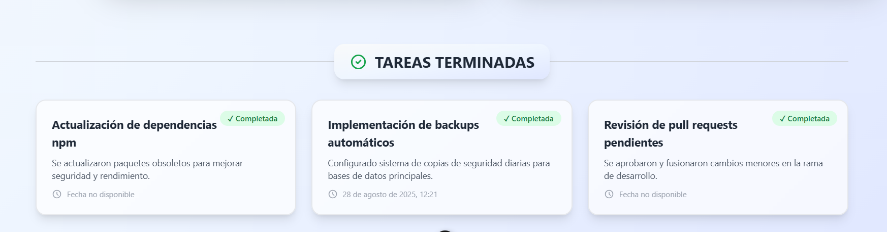

# 🧠 prioreisen - Prioriza con claridad, actúa con intención

**"Lo que es importante rara vez es urgente y lo que es urgente rara vez es importante."**

Prioreisen es una aplicación de gestión de tareas basada en la **Matriz de Eisenhower**, diseñada para ayudarte a priorizar inteligentemente tus actividades diarias diferenciando lo importante de lo urgente.

---

## 🚀 Tecnologías

### Backend

-   ⚙️ **Framework:** [Laravel 11](https://laravel.com/)
-   🗄️ **Base de datos:** MySQL / SQLite
-   🔐 **API:** RESTful con CORS configurado

### Frontend

-   🌐 **Framework:** [Vue 3](https://vuejs.org/) + [Vite](https://vitejs.dev/)
-   🎨 **Estilos:** [Tailwind CSS](https://tailwindcss.com/)
-   ✨ **Animaciones:** [@vueuse/motion](https://motion.vueuse.org/)
-   🔔 **Notificaciones:** [Vue Toastification](https://vue-toastification.maronato.dev/)
-   🎭 **Modales:** [SweetAlert2](https://sweetalert2.github.io/)
-   🎯 **Drag & Drop:** [Vuedraggable](https://github.com/SortableJS/vue.draggable.next)

---

## ✨ Características Destacadas

### 🎨 Diseño Moderno

-   **Gradientes vibrantes** en cuadrantes (azul, verde, amarillo, gris)
-   **Glassmorphism** en header y cards
-   **Efectos de hover** fluidos y profesionales
-   **Iconos SVG** personalizados en toda la interfaz
-   **Scrollbar personalizada** con colores del tema
-   **Fondo con gradiente** sutil (gris → azul → índigo)

### ✨ Animaciones Fluidas

-   **Entrada animada** de todos los componentes
-   **Transiciones suaves** al mover tareas
-   **Efectos de escala** en botones y cards
-   **Indicadores visuales** al arrastrar elementos
-   **Micro-interacciones** en toda la aplicación

### 🔔 Sistema de Notificaciones

-   **Toast notifications** elegantes y discretas
-   **Feedback inmediato** para todas las acciones
-   **Estados visuales**: éxito, error, info, advertencia
-   **Posicionamiento inteligente** (esquina superior derecha)
-   **Auto-dismiss** configurable

### 🎯 Gestión de Tareas

-   **Crear, editar y eliminar** tareas fácilmente
-   **Drag & drop** entre cuadrantes para re-priorizar
-   **Marcar como completadas** con un clic
-   **Recuperar tareas** de la sección terminadas
-   **Visualización clara** del estado de cada tarea
-   **Descripción expandible** para textos largos

---

## 🧩 Estructura del Proyecto

### 📁 Backend (Laravel)

-   **Modelos principales:**

    -   `User` (opcional, si se activa la autenticación)
    -   `Task`
        -   `title` (string) - Título de la tarea
        -   `description` (text) - Descripción detallada
        -   `important` (boolean) - Marca si es importante
        -   `urgent` (boolean) - Marca si es urgente
        -   `due_date` (nullable, date) - Fecha de finalización
        -   `status` (enum: `pending`, `in_progress`, `completed`)
        -   El **cuadrante** se determina automáticamente combinando `important` y `urgent`

-   **API RESTful:**

    -   `GET /api/tasks` – Listar todas las tareas
    -   `POST /api/tasks` – Crear nueva tarea
    -   `PATCH /api/tasks/{id}` – Actualizar tarea
    -   `DELETE /api/tasks/{id}` – Eliminar tarea

-   **CORS:** Configurado para permitir desarrollo local y producción

### 📁 Frontend (Vue 3)

-   **Componentes principales:**

    -   `App.vue` - Componente raíz con layout principal
    -   `AppHeader.vue` - Cabecera con logo y frase motivacional
    -   `MainComponent.vue` - Matriz de Eisenhower y lógica principal
    -   `TaskCard.vue` - Card individual para cada tarea

-   **Características técnicas:**

    -   **Composición API** (Vue 3 script setup)
    -   **Reactive state** con `ref()` y `computed()`
    -   **Lifecycle hooks** para carga de datos
    -   **Event emitters** para comunicación entre componentes
    -   **Optimistic UI updates** para mejor UX

-   **Organización de Cuadrantes:**
    1. 🟦 **Hacer Ya** (Importante + Urgente) - Crisis y emergencias
    2. 🟩 **Planificar** (Importante + No Urgente) - Planificación y desarrollo
    3. 🟨 **Delegar** (No Importante + Urgente) - Interrupciones y distracciones
    4. ⬜ **Eliminar** (No Importante + No Urgente) - Pérdidas de tiempo

---

## 📦 Instalación y Ejecución

### Requisitos Previos

-   **Node.js** 18+ y npm
-   **PHP** 8.1+
-   **Composer**
-   **MySQL** / **SQLite**

### Backend (Laravel)

```bash
# Clonar el repositorio
git clone https://github.com/colidom/prioreisen.git
cd prioreisen/backend

# Instalar dependencias
composer install

# Configurar entorno
cp .env.example .env
php artisan key:generate

# Configurar base de datos en .env
# DB_CONNECTION=mysql (o sqlite)
# DB_DATABASE=prioreisen
# DB_USERNAME=tu_usuario
# DB_PASSWORD=tu_contraseña

# Migrar base de datos
php artisan migrate

# Limpiar caché de configuración
php artisan config:clear

# Iniciar servidor
php artisan serve
# El backend estará disponible en http://localhost:8000
```

### Frontend (Vue)

```bash
cd prioreisen/frontend

# Instalar dependencias
npm install

# Configurar URL del backend
# Edita src/config.js y asegúrate de que apunte a tu backend:
# export const API_URL = "http://localhost:8000/api"

# Iniciar servidor de desarrollo
npm run dev
# El frontend estará disponible en http://localhost:5173
```

### 🐳 Usando Docker (Opcional)

```bash
# Desde la raíz del proyecto
docker-compose up -d

# El backend estará en http://localhost:8000
# El frontend estará en http://localhost:5173
```

---

## 🎯 Funcionalidades Principales

### 📝 Gestión de Tareas

-   ✅ **Crear tareas** - Modal intuitivo con validación
-   ✏️ **Editar tareas** - Modificar título y descripción
-   🎯 **Mover entre cuadrantes** - Drag & drop fluido con feedback visual
-   ✔️ **Completar tareas** - Marca como terminada con notificación
-   🔄 **Recuperar tareas** - Restaura tareas completadas a cualquier cuadrante
-   🗑️ **Eliminar tareas** - Con confirmación para evitar errores

### 🎨 Experiencia de Usuario

-   💫 **Animaciones fluidas** - Entrada, salida y transiciones
-   🔔 **Notificaciones toast** - Feedback inmediato de acciones
-   📱 **Diseño responsive** - Optimizado para móvil, tablet y escritorio
-   🎨 **Tema moderno** - Gradientes y efectos glassmorphism
-   ⚡ **Carga optimista** - Actualización instantánea de UI
-   🎯 **Estados visuales** - Indicadores claros de drag, hover, etc.

### 🔧 Características Técnicas

-   ⚡ **Hot Module Replacement** (HMR) con Vite
-   🎯 **TypeScript ready** (configuración preparada)
-   📦 **Bundle optimizado** para producción
-   🔐 **CORS configurado** para desarrollo y producción
-   💾 **Persistencia de datos** vía API REST
-   🔄 **Sincronización en tiempo real** con el backend

---

## 🧠 Filosofía de la Matriz de Eisenhower

> "Lo que es importante rara vez es urgente y lo que es urgente rara vez es importante."
> — Dwight D. Eisenhower

La Matriz de Eisenhower es una herramienta de gestión del tiempo que te ayuda a decidir sobre y priorizar tareas por urgencia e importancia:

### 🟦 Cuadrante 1: HACER YA

**Importante y Urgente**

-   Crisis, emergencias, deadlines inminentes
-   **Acción:** Hacer inmediatamente
-   **Ejemplo:** Bug crítico en producción, presentación de mañana

### 🟩 Cuadrante 2: PLANIFICAR

**Importante pero No Urgente**

-   Planificación, desarrollo personal, relaciones
-   **Acción:** Programar y hacer con calma
-   **Ejemplo:** Aprender nueva tecnología, hacer ejercicio, planificar proyecto

### 🟨 Cuadrante 3: DELEGAR

**No Importante pero Urgente**

-   Interrupciones, algunas llamadas, algunos correos
-   **Acción:** Delegar a otros si es posible
-   **Ejemplo:** Reuniones poco productivas, solicitudes de otros

### ⬜ Cuadrante 4: ELIMINAR

**Ni Importante ni Urgente**

-   Distracciones, pérdidas de tiempo, trivialidades
-   **Acción:** Eliminar o minimizar
-   **Ejemplo:** Scroll infinito en redes, TV sin propósito

---

## 🧪 API REST

### Endpoints Disponibles

#### Listar todas las tareas

```http
GET /api/tasks
```

**Respuesta:**

```json
[
    {
        "id": 1,
        "title": "Preparar presentación",
        "description": "Slides para el cliente XYZ",
        "important": true,
        "urgent": true,
        "status": "pending",
        "due_date": null,
        "created_at": "2025-01-15T10:00:00.000000Z",
        "updated_at": "2025-01-15T10:00:00.000000Z"
    }
]
```

#### Crear nueva tarea

```http
POST /api/tasks
Content-Type: application/json

{
  "title": "Nueva tarea",
  "description": "Descripción detallada",
  "important": true,
  "urgent": false,
  "status": "pending"
}
```

#### Actualizar tarea

```http
PATCH /api/tasks/{id}
Content-Type: application/json

{
  "title": "Título actualizado",
  "description": "Nueva descripción",
  "important": false,
  "urgent": true
}
```

#### Eliminar tarea

```http
DELETE /api/tasks/{id}
```

---

## 🎨 Paleta de Colores

### Cuadrantes

-   **Hacer Ya:** `#3B82F6` → `#2563EB` (Azul)
-   **Planificar:** `#10B981` → `#059669` (Verde)
-   **Delegar:** `#F59E0B` → `#D97706` (Amarillo)
-   **Eliminar:** `#6B7280` → `#4B5563` (Gris)

### Acentos

-   **Primario:** `#4F46E5` (Índigo)
-   **Secundario:** `#7C3AED` (Púrpura)
-   **Éxito:** `#10B981` (Verde)
-   **Error:** `#EF4444` (Rojo)
-   **Advertencia:** `#F59E0B` (Amarillo)
-   **Info:** `#3B82F6` (Azul)

---

## 📱 Responsive Design

### Breakpoints Tailwind

-   **sm:** 640px (Móviles grandes y tablets pequeñas)
-   **md:** 768px (Tablets)
-   **lg:** 1024px (Laptops)
-   **xl:** 1280px (Escritorio)
-   **2xl:** 1536px (Pantallas grandes)

### Optimizaciones

-   Grid adaptativo para matriz de cuadrantes
-   Header colapsable en móviles
-   Botones y cards con tamaños apropiados
-   Tipografía escalable
-   Imágenes responsive

---

## 🛠️ Scripts Disponibles

### Frontend

```bash
npm run dev      # Servidor de desarrollo con HMR
npm run build    # Build para producción
npm run preview  # Preview del build de producción
npm run lint     # Linter con ESLint
npm run format   # Formatear código con Prettier
```

### Backend

```bash
php artisan serve          # Servidor de desarrollo
php artisan migrate        # Ejecutar migraciones
php artisan migrate:fresh  # Reiniciar base de datos
php artisan config:clear   # Limpiar caché de configuración
php artisan cache:clear    # Limpiar caché general
```

---

## 🔧 Configuración Avanzada

### CORS (Backend)

Archivo: `backend/config/cors.php`

Por defecto permite desarrollo local. Para producción, actualiza:

```php
'allowed_origins' => [
    'https://tu-dominio.com'
],
```

### Tailwind CSS

Archivo: `frontend/tailwind.config.js`

Personaliza colores, animaciones y más:

```javascript
theme: {
  extend: {
    colors: {
      primary: { ... },
    },
    animation: { ... }
  }
}
```

### Notificaciones Toast

Archivo: `frontend/src/main.js`

Configura posición, duración y comportamiento:

```javascript
app.use(Toast, {
    position: "top-right",
    timeout: 3000,
    // ... más opciones
});
```

---

## 📸 Capturas de Pantalla

### Vista Principal



### Crear Nueva Tarea



### Tareas Completadas



---

## 🐛 Solución de Problemas

### Error de CORS

**Problema:** `Access to fetch has been blocked by CORS policy`

**Solución:**

```bash
# En el backend
cd backend
php artisan config:clear
php artisan serve
```

### Dependencias no instaladas

**Problema:** Errores de módulos no encontrados

**Solución:**

```bash
# Frontend
cd frontend
rm -rf node_modules package-lock.json
npm install

# Backend
cd backend
rm -rf vendor composer.lock
composer install
```

### Puerto ocupado

**Problema:** El puerto 5173 o 8000 está en uso

**Solución:**

```bash
# Frontend - usar otro puerto
npm run dev -- --port 3000

# Backend - usar otro puerto
php artisan serve --port=8001
```

---

## 📌 Roadmap / Próximas Mejoras

### Versión 2.0

-   [ ] 🔐 Sistema de autenticación de usuarios
-   [ ] 👥 Colaboración en tiempo real (WebSockets)
-   [ ] 🏷️ Etiquetas y categorías para tareas
-   [ ] 📅 Integración con calendario
-   [ ] 🔔 Recordatorios y notificaciones push
-   [ ] 📊 Dashboard con estadísticas y métricas
-   [ ] 🌙 Modo oscuro
-   [ ] 🌍 Internacionalización (i18n)
-   [ ] 📱 Aplicación móvil nativa (React Native / Flutter)
-   [ ] 🔄 Sincronización offline-first
-   [ ] 📤 Exportar/Importar tareas (CSV, JSON)
-   [ ] 🔍 Búsqueda avanzada y filtros

### Versión 2.1

-   [ ] 🎯 Subtareas y listas de verificación
-   [ ] 📎 Adjuntar archivos a tareas
-   [ ] 💬 Comentarios en tareas
-   [ ] 🔗 Integración con Trello, Notion, etc.
-   [ ] 🤖 Sugerencias con IA para priorización
-   [ ] 📈 Reportes y análisis de productividad

---

## 🤝 Contribuciones

¡Las contribuciones son bienvenidas! Si quieres mejorar prioreisen:

1. **Fork** el proyecto
2. Crea una **rama** para tu feature (`git checkout -b feature/AmazingFeature`)
3. **Commit** tus cambios (`git commit -m 'Add some AmazingFeature'`)
4. **Push** a la rama (`git push origin feature/AmazingFeature`)
5. Abre un **Pull Request**

### Guías de Contribución

-   Sigue el estilo de código existente
-   Escribe tests para nuevas funcionalidades
-   Actualiza la documentación si es necesario
-   Usa commits descriptivos siguiendo [Conventional Commits](https://www.conventionalcommits.org/)

---

## 📄 Licencia

Este proyecto está bajo la licencia MIT. Ver el archivo [LICENSE](LICENSE) para más detalles.

---

## 👨‍💻 Autor

**Carlos Oliva** (colidom)

-   GitHub: [@colidom](https://github.com/colidom)
-   LinkedIn: [Carlos Oliva](https://linkedin.com/in/colidom)

---

## 🙏 Agradecimientos

-   Inspirado en la Matriz de Eisenhower
-   Construido con tecnologías open source increíbles
-   Diseño inspirado en las mejores prácticas de UI/UX modernas

---

## 📚 Recursos Adicionales

-   [Documentación de Vue 3](https://vuejs.org/)
-   [Documentación de Laravel](https://laravel.com/docs)
-   [Guía de Tailwind CSS](https://tailwindcss.com/docs)
-   [Matriz de Eisenhower en Wikipedia](https://es.wikipedia.org/wiki/Matriz_de_Eisenhower)
-   [Libro: "Los 7 Hábitos de la Gente Altamente Efectiva"](https://www.amazon.com/dp/1982137274)

---

<div align="center">

**⭐ Si te gusta este proyecto, dale una estrella en GitHub ⭐**

Made with ❤️ and ☕ by [colidom](https://github.com/colidom)

</div>
