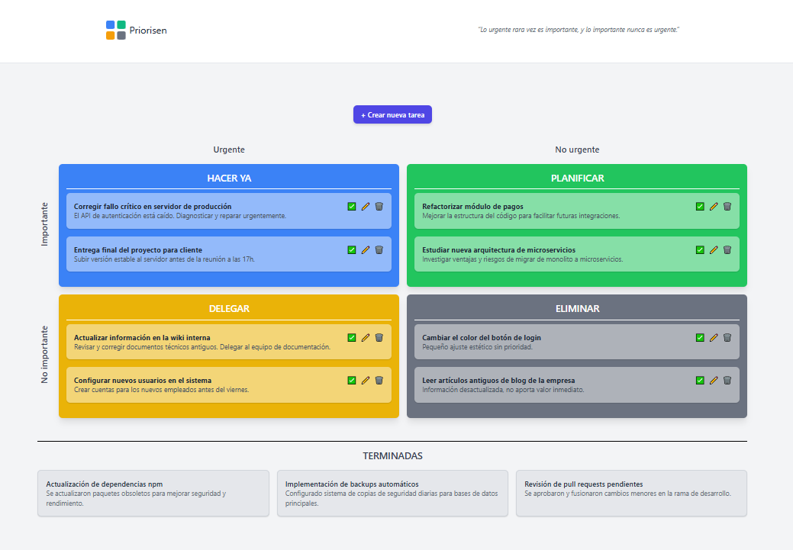

# 🧠 Priorisen - Prioriza con claridad, actúa con intención

**"Lo que es importante rara vez es urgente y lo que es urgente rara vez es importante."**

Priorisen es una aplicación de gestión de tareas basada en la **Matriz de Eisenhower**, diseñada para ayudarte a priorizar inteligentemente tus actividades diarias diferenciando lo importante de lo urgente.

---

## 🚀 Tecnologías

-   ⚙️ **Backend:** [Laravel 11](https://laravel.com/)
-   🌐 **Frontend:** [Vue 3 + Vite](https://vitejs.dev/)
-   🧪 **Base de datos:** MySQL o SQLite

---

## 🧩 Estructura del Proyecto

### 📁 Backend (Laravel)

-   **Modelos principales:**

    -   `User` (opcional, si se activa la autenticación)
    -   `Task`

        -   `title` (string)
        -   `description` (text)
        -   `important` (boolean)
        -   `urgent` (boolean)
        -   `due_date` (nullable, date)
        -   `status` (`pending`, `in_progress`, `completed`)
        -   El **cuadrante** se determina automáticamente combinando los valores de `important` y `urgent`.

-   **API RESTful:**

    -   `GET /api/tasks` – Listar tareas
    -   `POST /api/tasks` – Crear tarea
    -   `PATCH /api/tasks/{id}` – Actualizar tarea
    -   `DELETE /api/tasks/{id}` – Eliminar tarea

### 📁 Frontend (Vue 3)

-   **Características:**

    -   Diseño basado en los 4 cuadrantes de la **Matriz Eisenhower**.
    -   **Crear, editar, completar y eliminar** tareas.
    -   **Drag & drop** para mover tareas entre cuadrantes.
    -   Visualización de tareas **terminadas** y posibilidad de **recuperarlas** a un cuadrante.
    -   Modal dinámico de creación/edición usando **SweetAlert2**.

-   **Organización de Cuadrantes:**

    1. 🟦 **Hacer Ya** (Importante + Urgente)
    2. 🟩 **Planificar** (Importante + No Urgente)
    3. 🟨 **Delegar** (No Importante + Urgente)
    4. ⬜ **Eliminar** (No Importante + No Urgente)

---

## 📦 Instalación y Ejecución

### Backend (Laravel)

```bash
git clone https://github.com/tu-usuario/priorisen.git
cd priorisen/backend
composer install
cp .env.example .env
php artisan key:generate
php artisan migrate
php artisan serve
```

### Frontend (Vue)

```bash
cd priorisen/frontend
npm install
npm run dev
```

-   Crea un archivo `config.js` en `src/` con la URL del backend:

```javascript
export const API_URL = "http://localhost:8000/api";
```

---

## 🎯 Funcionalidades principales

-   Crear tareas: Desde el botón "+ Crear nueva tarea", usando un modal dinámico.
-   Editar tareas: Edita título y descripción rápidamente desde el modal.
-   Mover tareas entre cuadrantes: Arrastra y suelta para re-priorizar.
-   Completar tareas: Las tareas finalizadas pasan a la sección "Terminadas".
-   Recuperar tareas: Permite mover tareas completadas de vuelta a cualquier cuadrante.
-   Eliminar tareas: Confirmación antes de borrar definitivamente.

---

## 🧠 Filosofía

> "Lo que es importante rara vez es urgente y lo que es urgente rara vez es importante."

Con esta idea, Priorisen divide tus tareas en 4 cuadrantes:

1. **🟦 Hacer ya** (Importante y Urgente)
2. **🟩 Planificar** (Importante pero No urgente)
3. **🟨 Delegar** (No importante pero Urgente)
4. **⬜ Eliminar** (Ni importante ni urgente)

---

## 📁 Componentes principales

-   `MainView.vue`: Contiene la lógica principal.
-   `TaskCard.vue`: Componente para representar tareas individuales.

## 🧪 API Esperada

El backend debe exponer una API REST con las siguientes rutas:

-   `GET /tasks` → Lista todas las tareas.
-   `POST /tasks` → Crea una nueva tarea.
-   `PATCH /tasks/:id` → Actualiza una tarea.
-   `DELETE /tasks/:id` → Elimina una tarea.

Formato de cada tarea:

```json
{
  "id": 1,
  "title": "Nombre de la tarea",
  "description": "Descripción detallada",
  "important": true,
  "urgent": false,
  "status": "pending" | "completed"
}
```

## ✅ Estado actual

Funcional y completo. Soporta creación, edición, clasificación y archivado de tareas.

## 📌 Próximas mejoras

-   Filtros por fecha o etiquetas.
-   Soporte para usuarios.
-   Notificaciones.

## 🛠 Requisitos

-   Node.js 18+
-   Backend RESTful en funcionamiento

---

## ✨ Capturas



## 🤝 Contribuciones

¡Contribuciones son bienvenidas! Si quieres mejorar Priorisen, por favor abre un issue o haz un pull request.

## 📜 Licencia

Este proyecto está bajo la licencia MIT.

---

Made with ❤️ por colidom
